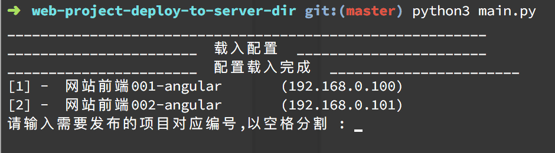

# python-deploy-vue-or-angular
将web网站发布到指定服务器的路径

# 运行
```bash
python3 main.py
```
# 流程

> 1. 载入文件及服务器的配置 ， 若没有，则停止
> 2. 打包本地需要上传的文件及文件夹 ， 若没有，则停止
> 3. 尝试打包本地文件到服务器指定上传目录，若失败，则停止
> 4. ssh远程打包需要替换的文件及文件夹，至文件备份目录，若失败，则停止
> 5. ssh远程删除需要替换的文件及文件夹，若失败，则停止
> 6. ssh远程解压上传的文件及文件夹到被替换的文件及文件夹位置
> 7. 退出ssh连接

__配置文件为列表存在__


# 截图

